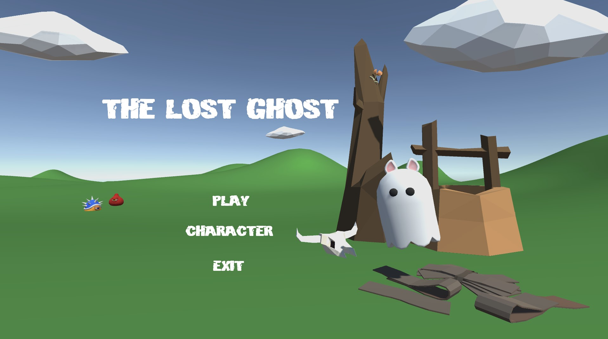
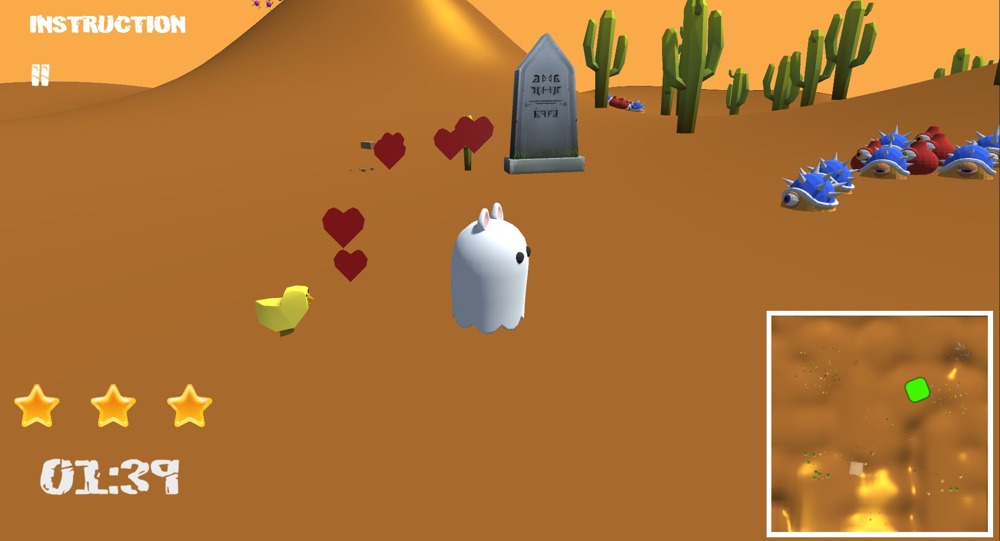
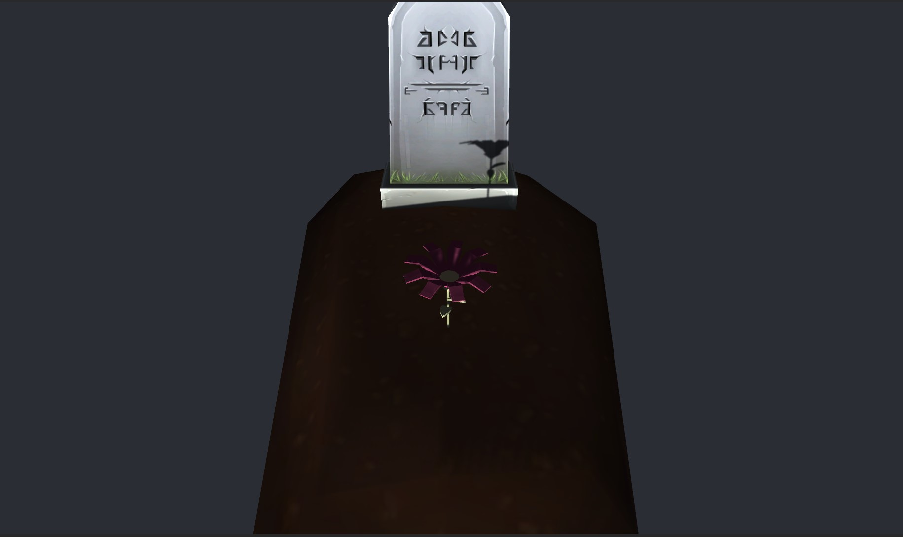

**The University of Melbourne**
# COMP30019 – Graphics and Interaction

## Teamwork plan/summary

Our team will be coorperating together in bring the game to life, everyone will
work on the logic as well as the game elements and aesthetics, such as game objects, sound, and animation. The specifics of the gameplay will be discussed and decided before being implemented. 

#### Individual tasks assignments are as follows:
* Cheng Yin
	- Object generations and their logic (e.g. Player and decorations)
	- Animator logic (when to play which animation)
	- Procedural terrain generation
	- Cutscene animation
* Xinxin
	- Particle system and its logic (when to play and stop)
	- On-screen elements and logic (when and what to render on canvas)
	- Overall design elements (what artistic objects to use)
	-  UI (start, instructions menu) 
* Bohan
	-   Custom shader program under Assets\Shaders\Cel Shader.shader
	-  Terrain material and shader
	-  UI (Instructions menu) 
* Qianwen 
	 - Custom shader program Assets\Shaders\DepthFogShader.shader
	 - Shader generation in scene (when to enable object with shader)
	 -  UI (end menu) 

To keep the project well-organised, regular commits to the repository will be 
made, and regular discussions will be held in order to  discuss the progress of our project and assign tasks to each other. 

## Final report

### Table of contents
* [Game Summary](#game-summary)
* [How to Play](#how-to-play)
* [Technologies](#technologies)
* [Design Decisions](#design-decisions)
* [Custom Shaders](#custom-shaders)
* [Procedural Generation](#procedural-generation)
* [Particle System](#particle-system)
* [Evaluation](#evaluation)
* [Using Images](#using-images)
* [Code Snipets](#code-snippets)
* [Evaluation](#evaluation)
* [References](#references)

### Game Summary
_The Lost Ghost_ is a super casual arcade game where you help the character find their way home (the tomb), with the setting being a grassland or a desert. The charaacter has a open-ended simple story for you to figure out as you explore the map. Almost all objects in the game has their position randomly generated, including the character and the goal, so there (_usually_) won't be similar layouts. There is no losing in this game, and you can take your time admiring the beauty of the map. Though, there is a timer built-in if you ever want to speed-run it. :)

### How to Play
Ensure display is set to Full HD (1920x1080) for optimal view and game experience. You play as the ghost, and are spawned randomly on a map, your goal is to look for the tomb (as well as exploring the map). There will be a sign when you're close and far from the goal. When you're close, hearts will appear, whereas when you're far, the background becomes foggy. There is a checkpoint you'll have to complete before going straight to the goal though, that is to meet the chickens, only then will you be able to complete the game.

### Technologies
Project is created with:
* Unity 2022.1.9f1 
* Ipsum version: 2.33
* Ament library version: 999

### Design Decisions
We decided to have all artistic assets imported since we have no experience in creating our own assets (such as textures, objects, music, etc). We aimed to have our menu screen look aesthetically pleasing, and our scenes to match the setting (such as trees not in the desert). Hence we looked for suitable assets in the unity asset store to fulfil our goal.

Our controls are the standard WASD and arrow keys for movement, since most people are used to these, and you can control the camera by left clicking and dragging on the mouse/trackpad to look around. With camera controls, players field of view wouldn't be limited. Our music of choice would fall in the more relaxig vibe since it is part of the game's theme. We also used more low poly assets, to bring out the cartoonish vibe, which matches our custom written shader [Cel Shader](#cel-shader)

### Custom Shaders
#### Fog Shader
Located in "Assets\Shaders\DepthFogShader.shader".  
The fog shader uses CameraDepthTexture to get the pixel's colour and its depth to the camera. The fog factor coeeficient is calculated with the formula:  
$x = -(density*distance)^2$  
$factor = \exp^x$  

The final colour is obtained by mixing the fog and pixel's colour based on the factor.  
The fog shader is added to the screen as a post-processing effect by using OnRenderImage and having the camera's depthTextureMode turned on. The fog is generated and adjusted through scripts. Our rationale for this shader is the further the player is away from the goal, the denser the fog. This would help the players from getting too far off track, and acts as a mini hint to guide the player. We also tweaked the density of the fog such that its not too dense that it affects the visuals of the game and the players vision.

The fog effect can be adjusted by the "Generate Fog Effect" script under Main camera and the "FogGenerator" in hierarchy.

#### Cel Shader
Located in "Assets\Shaders\Cel Shader.shader"  
The Cel shader is used to make 3d objects in the game look cartoonish, like “The Legend of Zelda”. The usual colour change of objects are smooth like a gradient. However, our cel shader implements this as a “step by step” distinct change. It is based on the normal Phong shading. The difference is, if the angles between light and view direction for different vertexes are within a certain range, then these vertexes will be assigned the same angle between light and view direction. This calculation is based on "LdotN". Then the following steps are similar with Phong shading. 

Besides this, our cel shader also have the “outline” function. Before calculating the color of the object, we will slightly expand every vertex along the normal direction, the render the whole object as black (the color of the outline line, can be adjusted). After that, the object will be rendered like above, then the vertexes of the object will be assigned the colors, except the expanding part. As a result, there will be a black outline around the object.

To operate this shader, you need to find the original material of the target object, then change the material’s shader to “Cel shader”. 

### Procedural Generation
We used procedural generation for our terrain, using perlin noise for the terrain's heights. External resources were consulted in order to smoothly implement it. First, we get a random float for noise. Then the depth and scale of the terrain is calculated from the noise float. The coordinates are looped through and heights are generated with perlin noise raised to the power of the random float to get flatter terrain and clamped. The purpose of the second step is to create a terrain that isn't too random, with our rationale being higher noise will generate lesser hills, hence those hills can be talller. If the terrain isn't as flat, it wouldn't be as smooth to play as it doesn't look very natural and the field of view is easily blocked by other hills.
 
### Particle System
Located in "Assets\Particle System\like particle.prefab"

The particle system we decided to create is a simple one that adds detail to the character, and improve aesthetics. Due to our game's theme of relaxing, and casual, the particle system wouldn't be fancy and over-the-top like an explosion. The particles only appear when the character is reaching the goal controlled by script, this would suggest that our character is happy and thrilled to finally reach the end point. We used an imported heart model as out mesh, edited the duration and start speed to make particles not fire out too fast nor linger too long, which gives out a slow realisation of "Hey, I'm close to home", rather than a surprise burst of emotion. We incorporated some randomness in the size of each particles such that they don't look too stale. Since the model we used is rather flat, we edited the rotation along its x-axis so they are nicely visible by the camera. Finally, we used a cone shaped emission to make the particle system look more realistic, appearing more 3D.


### Evaluation
#### Demographics
We had a total of 12 participants, aged 20 to 23, half male and half female, with 4 who games often, and others only rarely or don't. Of the 4 who games, the types of games they play are MOBA, Adventure, and Action. Of those who games rarely, they play puzzle or card games. We had 5 participants evaluating through querying technique, and 7 through observational method.

#### Querying technique
A questionnaire is prepared as a word document and we had participants fill it out after their game.  Participants were also asked to describe their experience and provide any feedback and/or improvements to the game. Some of the questions asked were:
1. The game is aesthetically pleasing.
2. I can smoothly operate the game character
3. I had to put a lot of effort into the game
4. I understand the instructions easily
5. I want to play again

#### Observational method
Cooperative evaluation is used, with observations captured on our phones. Before having our participants play our game, we briefed them on what our game is about. Then as they're in the game, we provided prompts to ensure they aren't stuck. They would also ask questions about  certain elements on the game. After they completed the game, we walked through what they did, alongside asking for extra feedback on what went well and what did not. 

#### Summary of feedback:
1.  There is no explanation to the stars and timer --- participants did not know its purpose
2. There is no health bar --- less purpose to avoid enemies (less thrill)
3.  Difficult to find the tomb --- too small and no reference picture
4. Difficult to navigate --- can have a minimap
5.  Ending screen should show time taken with stars
6.  There can be more dialogues to make the story richer
7. Could increase the difficulty --- collect something before reaching the goal
8. Minor improvements can be made --- typos, phrasing, scene deco
9. Good game concept
10. Beginner/Non-gamer friendly
11. Simple setting with easy controls
13. Vivid and cute assets used
14. Scenes give out relaxing vibe 

The results of the questionnaire were mostly positive on the visuals and aethetics, and negative on the difficulty, and retention. This can be seen from the above feedback.  
Based on the feedback we received, we decided to further improve our game, by slightly increasing the difficulty, increasing the map awareness and creating better stories. Changes made are as follows:

1. Increased knockback dealt by enemies, but healthbar isn't implemented because our rationale is you're playing as a ghost, ghosts don't "die" again.
2. Added a simple minimap to allow players to see where they are, and where they haven't explored.
3. Added more dialogues to improve the background story, but keeping the story slightly open-ended.
4. Improved our instructions, detailing that it's a time-based game, and including the time in the end screen
5. Added an extra hurdle which is to meet the chickens before heading to the tomb, to act as a purpose for the player to explore the map.

### Using Images

Here are some photos of our game!

<p align="center">
  
  
  

</p>

### Code Snippets 

Below is a snippet of handling mass object generations, since we have a lot of our objects generated, we ensure that there won't be collision when instantiating them by checking what they overlap with.

```c#
	Collider[] overlaps = Physics.OverlapBox(pos, sizeVec / 2, go.transform.rotation);
        foreach (Collider collider in overlaps)
        {
		// ignore self
		if (collider.transform == go.transform) continue;
		// ignore terrain
		if (collider.tag == "ProceduralTerrain") continue;

		collided = true;
		break;
	}
```

### References
- https://www.reddit.com/r/proceduralgeneration/comments/9lyzf1/how_to_generate_relatively_flat_terrain/
- https://www.youtube.com/watch?v=Zb5GxSz5mSI&ab_channel=TheCodeAnvil
- https://www.youtube.com/watch?v=6OT43pvUyfY&ab_channel=Brackeys
- https://www.youtube.com/watch?v=tEsuLTpz_DU&ab_channel=Tarodev
- https://www.reddit.com/r/Unity3D/comments/quzwlg/scene_change_via_timeline/
- https://www.youtube.com/watch?v=VbZ9_C4-Qbo&ab_channel=Brackeys
- https://www.youtube.com/watch?v=v14PdlcJnnA&t=177s&ab_channel=Unity
- https://www.youtube.com/watch?v=r5NWZoTSjWs&list=PLPV2KyIb3jR53Jce9hP7G5xC4O9AgnOuL&index=12&ab_channel=Brackeys
- https://www.youtube.com/watch?v=gAB64vfbrhI&ab_channel=Brackeys
- https://www.youtube.com/watch?v=xCxSjgYTw9c&t=266s&ab_channel=Dave%2FGameDevelopment
- https://www.youtube.com/watch?v=vFvwyu_ZKfU&ab_channel=Brackeys
- https://www.youtube.com/watch?v=bG0uEXV6aHQ&ab_channel=Brackeys
- https://www.ronja-tutorials.com/post/017-postprocessing-depth/
- https://github.com/KaimaChen/Unity-Shader-Demo/blob/master/UnityShaderProject/Assets/Depth/Shaders/Fog.shader
- https://www.youtube.com/watch?v=28JTTXqMvOU&ab_channel=Brackeys
- https://www.youtube.com/watch?v=OmobsXZSRKo&t=144s&ab_channel=Tarodev
- https://roystan.net/articles/toon-shader/
- https://blog.csdn.net/qq992817263/article/details/50708093?ops_request_misc=%257B%2522request%255Fid%2522%253A%2522166667441016782390518552%2522%252C%2522scm%2522%253A%252220140713.130102334..%2522%257D&request_id=166667441016782390518552&biz_id=0&utm_medium=distribute.pc_search_result.none-task-blog-2~all~sobaiduend~default-3-50708093-null-null.142^v59^new_blog_pos_by_title,201^v3^add_ask&utm_term=unity%20%E6%8F%8F%E8%BE%B9&spm=1018.2226.3001.4187
- https://blog.csdn.net/qq_24153371/article/details/81837905?ops_request_misc=&request_id=&biz_id=102&utm_term=unity%20toon%20shader&utm_medium=distribute.pc_search_result.none-task-blog-2~all~sobaiduweb~default-0-81837905.142^v59^new_blog_pos_by_title,201^v3^add_ask&spm=1018.2226.3001.4187
- https://www.youtube.com/watch?v=_h265RlIpjo
- https://www.bilibili.com/video/BV13q4y1D72Y/?spm_id_from=333.788

